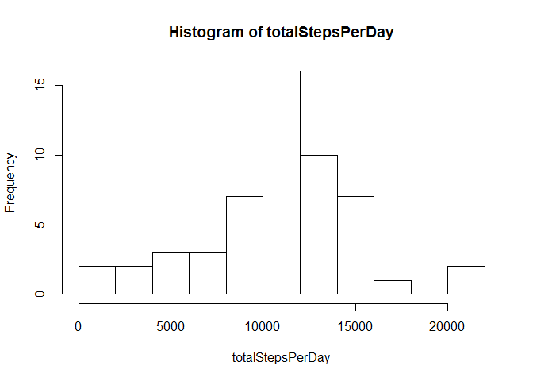
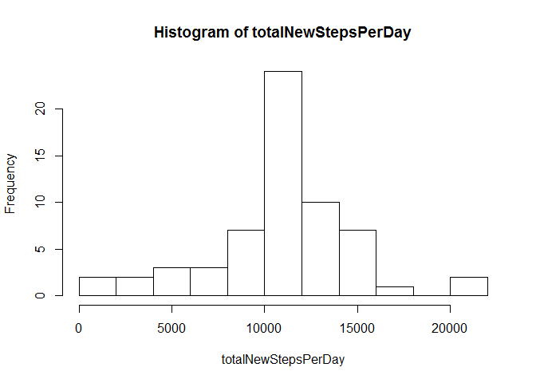
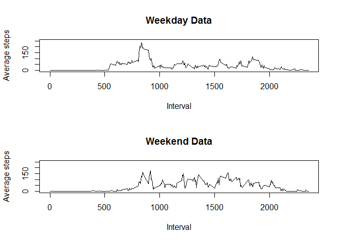

# Reproducible Research: Peer Assessment 1


## Loading and preprocessing the data

```r
activityData <- read.csv("activity.csv")
activityData$date <- as.Date(activityData$date)
completeData <- activityData[complete.cases(activityData),]
str(activityData)
```

```
## 'data.frame':	17568 obs. of  3 variables:
##  $ steps   : int  NA NA NA NA NA NA NA NA NA NA ...
##  $ date    : Date, format: "2012-10-01" "2012-10-01" ...
##  $ interval: int  0 5 10 15 20 25 30 35 40 45 ...
```

```r
summary(activityData)
```

```
##      steps            date               interval   
##  Min.   :  0.0   Min.   :2012-10-01   Min.   :   0  
##  1st Qu.:  0.0   1st Qu.:2012-10-16   1st Qu.: 589  
##  Median :  0.0   Median :2012-10-31   Median :1178  
##  Mean   : 37.4   Mean   :2012-10-31   Mean   :1178  
##  3rd Qu.: 12.0   3rd Qu.:2012-11-15   3rd Qu.:1766  
##  Max.   :806.0   Max.   :2012-11-30   Max.   :2355  
##  NA's   :2304
```

## What is mean total number of steps taken per day?


```r
stepsPerDay <- split(activityData$steps,activityData$date)
totalStepsPerDay <- sapply(stepsPerDay,sum)
summary(totalStepsPerDay)
```

```
##    Min. 1st Qu.  Median    Mean 3rd Qu.    Max.    NA's 
##      41    8840   10800   10800   13300   21200       8
```

```r
hist(totalStepsPerDay,breaks = 10)
```

 

## What is the average daily activity pattern?

```r
stepsPerInterval <- split(completeData$steps,completeData$interval)
avgStepsPerInterval <- sapply(stepsPerInterval,mean)
avgStepsPerIntervalFrame <- data.frame(interval = as.numeric(names(avgStepsPerInterval)), steps = avgStepsPerInterval)
plot(x=avgStepsPerIntervalFrame$interval,y=avgStepsPerIntervalFrame$steps,type = "l",xlab="Interval",ylab="Average steps")
```

 

```r
avgStepsPerInterval[avgStepsPerInterval == max(avgStepsPerInterval)]
```

```
##   835 
## 206.2
```

## Imputing missing values
NA's Count:

```r
summary(activityData$steps)[7]
```

```
## NA's 
## 2304
```

We will use the average value for the specified interval for all days to fill the NA's for the same interval.


```r
head(avgStepsPerInterval,15)
```

```
##       0       5      10      15      20      25      30      35      40 
## 1.71698 0.33962 0.13208 0.15094 0.07547 2.09434 0.52830 0.86792 0.00000 
##      45      50      55     100     105     110 
## 1.47170 0.30189 0.13208 0.32075 0.67925 0.15094
```

```r
stepsPerDay <- split(activityData$steps,activityData$date)
func <- function(l) 
  {
    for (i in 1:length(avgStepsPerInterval))
      {
        if(is.na(l[i]))
          {
          l[i] <- avgStepsPerInterval[i]
          }
      
      }
    l
  }
newStepsPerDay <- lapply(stepsPerDay,func)
totalNewStepsPerDay <- sapply(newStepsPerDay,sum)
summary(totalNewStepsPerDay)
```

```
##    Min. 1st Qu.  Median    Mean 3rd Qu.    Max. 
##      41    9820   10800   10800   12800   21200
```

```r
hist(totalNewStepsPerDay,breaks = 10)
```

 


## Are there differences in activity patterns between weekdays and weekends?

We will define weekend days as Saturday and Sunday.


```r
newData <- completeData
weekendDays <- c("Saturday", "Sunday")
newData$day <- ifelse(weekdays(newData$date) %in% weekendDays,"weekend", "weekday")
newData$day <- as.factor(newData$day)

seperatedData <- split(newData,newData$day)
par(mfrow=c(2,1))
l <- seperatedData$weekday
stepsPerInterval <- split(l$steps,l$interval)
avgStepsPerInterval <- sapply(stepsPerInterval,mean)
avgStepsPerIntervalFrame <- data.frame(interval = as.numeric(names(avgStepsPerInterval)), steps = avgStepsPerInterval)
plot(x=avgStepsPerIntervalFrame$interval,y=avgStepsPerIntervalFrame$steps,type = "l",xlab="Interval",ylab="Average steps", main = "Weekday Data", ylim = c(0,250))

l <- seperatedData$weekend
stepsPerInterval <- split(l$steps,l$interval)
avgStepsPerInterval <- sapply(stepsPerInterval,mean)
avgStepsPerIntervalFrame <- data.frame(interval = as.numeric(names(avgStepsPerInterval)), steps = avgStepsPerInterval)
plot(x=avgStepsPerIntervalFrame$interval,y=avgStepsPerIntervalFrame$steps,type = "l",xlab="Interval",ylab="Average steps", main = "Weekend Data", ylim = c(0,250))
```

 
